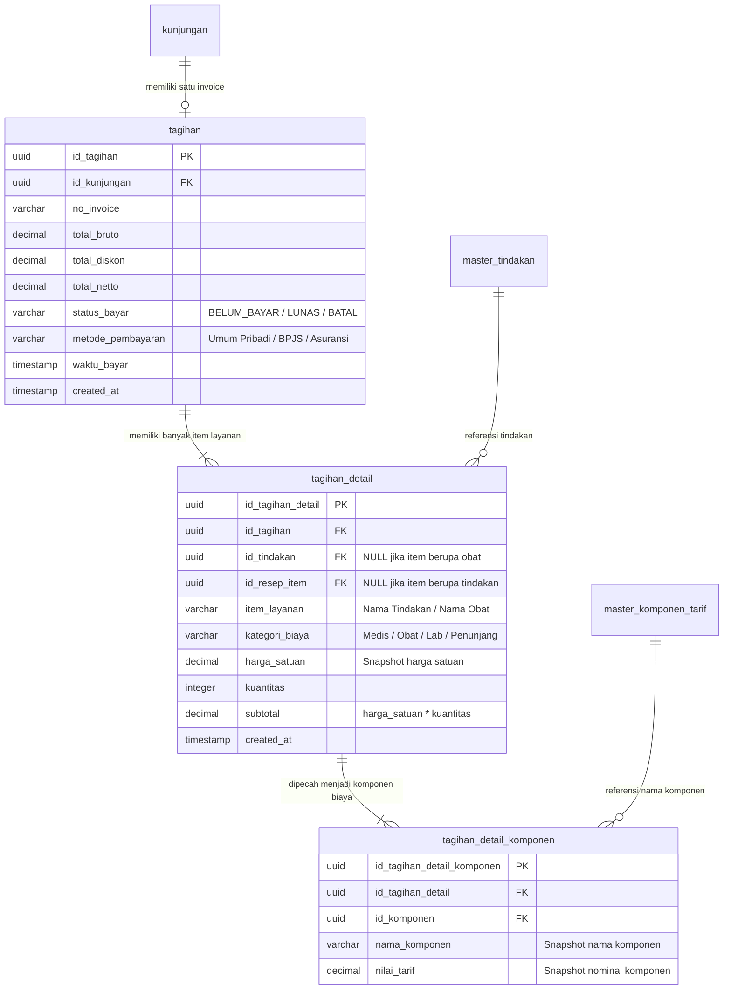

# Rekomendasi Arsitektur & Skema Database Billing Pasien (Klinik HNZ)

Dokumen ini menyajikan rekomendasi desain arsitektur database untuk modul **Billing & Invoice Pasien** di Klinik HNZ. Desain ini dirancang khusus untuk memenuhi tiga kebutuhan utama Anda:
1. **Total Billing Pasien Saat Ini** (Header Invoice)
2. **Detail Tarif Pasian** (Item Tindakan & Obat yang dikonsumsi)
3. **Detail Tarif per Komponen (Snapshot)** untuk menghitung unit cost, bagi hasil (dokter/perawat), dan profitabilitas klinik.

---

## 💡 Prinsip Desain Utama: "Transaction Snapshotting"

> [!IMPORTANT]
> **Mengapa Kita Tidak Boleh Hanya Merelasikan Billing ke Tabel Master Harga?**
> Harga tindakan medis dan pembagian komponen (misalnya tarif Jasa Medis Dokter atau BHP) bersifat dinamis dan dapat berubah sewaktu-waktu sesuai kebijakan klinik.
>
> Jika tabel detail billing pasien langsung mengambil relasi hidup ke tabel `master_harga_tindakan`, maka **riwayat laporan keuangan masa lalu akan rusak/berubah** saat manajemen memperbarui tarif tindakan di masa depan.
>
> **Solusi Standar Enterprise:**
> Kita harus melakukan **snapshotting (perekaman permanen)** atas nominal total dan pecahan komponen biaya tepat pada saat tindakan medis tersebut diberikan kepada pasien.

---

## 📊 Diagram Relasi Database (ERD)

Berikut adalah visualisasi bagaimana tabel billing terhubung dengan sistem kunjungan pasien dan master tarif tindakan:



---

## 🛠️ Rancangan Skema Prisma (schema.prisma)

Berikut adalah usulan struktur model database di Prisma untuk memperluas tabel `tagihan` dan `tagihan_detail` yang sudah ada, serta menambahkan `tagihan_detail_komponen`.

### 1. Tabel Header Billing (`tagihan`)
Tabel ini merepresentasikan satu invoice per kunjungan pasien. Menampung total akumulasi tagihan dan status pembayarannya.

```prisma
model tagihan {
  id_tagihan        String           @id @default(dbgenerated("gen_random_uuid()")) @db.Uuid
  id_kunjungan      String           @unique @db.Uuid // Satu kunjungan memiliki satu billing utama
  no_invoice        String           @unique @db.VarChar(50)
  
  // Rekapitulasi Keuangan (Kebutuhan #1)
  total_bruto       Decimal          @default(0) @db.Decimal(15, 2)
  total_diskon      Decimal          @default(0) @db.Decimal(15, 2)
  total_netto       Decimal          @default(0) @db.Decimal(15, 2) // total_bruto - total_diskon
  
  status_bayar      String           @default("BELUM_BAYAR") @db.VarChar(20) // BELUM_BAYAR, LUNAS, BATAL
  metode_pembayaran String?          @db.VarChar(50) // Umum Pribadi, BPJS, dll.
  waktu_bayar       DateTime?        @db.Timestamp(6)
  
  created_at        DateTime         @default(now()) @db.Timestamp(6)
  updated_at        DateTime         @updatedAt @db.Timestamp(6)

  // Relasi
  kunjungan         kunjungan        @relation(fields: [id_kunjungan], references: [id_kunjungan], onDelete: Cascade)
  tagihan_detail    tagihan_detail[]
}
```

### 2. Tabel Item Billing (`tagihan_detail`)
Tabel ini menyimpan daftar tindakan medis, jasa konsultasi, obat-obatan, maupun pemeriksaan lab yang dijalani pasien selama kunjungan.

```prisma
model tagihan_detail {
  id_tagihan_detail String           @id @default(dbgenerated("gen_random_uuid()")) @db.Uuid
  id_tagihan        String           @db.Uuid
  
  // Relasi ke Master (Opsional untuk pelacakan statistik, di-set NULLABLE demi fleksibilitas)
  id_tindakan       String?          @db.Uuid
  id_resep_item     String?          @db.Uuid
  
  // Snapshot Data Transaksi (Kebutuhan #2)
  item_layanan      String           @db.VarChar(255) // Contoh: "Konsultasi Dokter Spesialis", "Paracetamol 500mg"
  kategori_biaya    String           @db.VarChar(50)  // Contoh: "Tindakan Medis", "Farmasi/Obat", "Administrasi"
  harga_satuan      Decimal          @default(0) @db.Decimal(15, 2)
  kuantitas         Int              @default(1)
  subtotal          Decimal          @default(0) @db.Decimal(15, 2) // harga_satuan * kuantitas
  
  created_at        DateTime         @default(now()) @db.Timestamp(6)

  // Relasi
  tagihan           tagihan          @relation(fields: [id_tagihan], references: [id_tagihan], onDelete: Cascade)
  master_tindakan   master_tindakan? @relation(fields: [id_tindakan], references: [id_tindakan], onDelete: SetNull)
  
  // Memecah item ini ke komponen penyusun
  tagihan_detail_komponen tagihan_detail_komponen[]
}
```

### 3. Tabel Detail Komponen Transaksi (`tagihan_detail_komponen`)
Tabel inilah yang menjadi **kunci utama untuk menghitung Cost Klinik/RS dan Jasa Medis (Kebutuhan #3)**. Setiap tindakan medis yang masuk ke `tagihan_detail` akan otomatis dipecah menjadi komponen biayanya di tabel ini.

```prisma
model tagihan_detail_komponen {
  id_tagihan_detail_komponen String         @id @default(dbgenerated("gen_random_uuid()")) @db.Uuid
  id_tagihan_detail          String         @db.Uuid
  id_komponen                String?        @db.Uuid // Relasi ke master_komponen_tarif
  
  // Snapshot Nilai Komponen Biaya saat Transaksi
  nama_komponen              String         @db.VarChar(100) // Contoh: "Jasa Sarana", "Jasa Medis (Dokter)", "BHP"
  nilai_tarif                Decimal        @default(0) @db.Decimal(15, 2)

  // Relasi
  tagihan_detail             tagihan_detail @relation(fields: [id_tagihan_detail], references: [id_tagihan_detail], onDelete: Cascade)
  master_komponen_tarif      master_komponen_tarif? @relation(fields: [id_komponen], references: [id_komponen], onDelete: SetNull)
}
```

---

## 📈 Contoh Kasus Simulasi Data Real

Mari kita simulasikan pasien bernama **Budi** berkunjung untuk melakukan tindakan **Nebulizer** (Total Tarif: Rp 85.000) dan membeli **Obat Batuk** (Total: Rp 15.000).

### 1. Data di Tabel `tagihan` (Header)
Tabel ini mencatat total tagihan Budi saat ini secara utuh.
* `id_tagihan`: `TAG-BUDI-123`
* `no_invoice`: `INV/2026/05/0045`
* `total_bruto`: `Rp 100.000`
* `total_diskon`: `Rp 0`
* `total_netto`: `Rp 100.000`
* `status_bayar`: `LUNAS`

### 2. Data di Tabel `tagihan_detail` (Item Layanan)
Terbagi menjadi 2 item belanjaan/layanan pasien.
* **Baris 1 (Tindakan):**
  * `id_tagihan_detail`: `DET-NEBU-01`
  * `item_layanan`: `"Nebulizer"`
  * `kategori_biaya`: `"Tindakan Medis"`
  * `harga_satuan`: `Rp 85.000`
  * `kuantitas`: `1`
  * `subtotal`: `Rp 85.000`
* **Baris 2 (Farmasi):**
  * `id_tagihan_detail`: `DET-OBAT-02`
  * `item_layanan`: `"Sirup Obat Batuk OBH"`
  * `kategori_biaya`: `"Farmasi/Obat"`
  * `harga_satuan`: `Rp 15.000`
  * `kuantitas`: `1`
  * `subtotal`: `Rp 15.000`

### 3. Data di Tabel `tagihan_detail_komponen` (Breakdown Profit/Cost)
Tindakan Nebulizer (`DET-NEBU-01`) di atas otomatis dipecah menjadi komponen biayanya untuk analisis profit/loss:
* **Komponen 1 (Jasa Sarana - Hak Klinik):**
  * `nama_komponen`: `"Jasa Sarana"`
  * `nilai_tarif`: `Rp 25.000`
* **Komponen 2 (BHP - Penggantian Modal Alat Medis):**
  * `nama_komponen`: `"Bahan Medis Habis Pakai (BHP)"`
  * `nilai_tarif`: `Rp 30.000`
* **Komponen 3 (Jasa Medis - Komisi Dokter):**
  * `nama_komponen`: `"Jasa Medis (Dokter)"`
  * `nilai_tarif`: `Rp 15.000`
* **Komponen 4 (Jasa Perawat - Komisi Perawat):**
  * `nama_komponen`: `"Jasa Perawat"`
  * `nilai_tarif`: `Rp 15.000`

---

## 📊 Manfaat Bisnis & Operasional untuk Manajemen Klinik

Dengan struktur database relasional tiga tingkat di atas, manajemen Klinik HNZ akan mendapatkan manfaat analisis keuangan luar biasa berikut secara instan:

1. **💸 Analisis Pengeluaran BHP Pasien (Cost Real Alat Medis):**
   Manajemen dapat menjumlahkan seluruh komponen `Bahan Medis Habis Pakai (BHP)` di tabel detail komponen untuk mengetahui persis berapa biaya pokok (HPP) alat kesehatan yang terpakai bulan ini.
   
2. **🩺 Kalkulator Otomatis Jasa Medis Dokter (Payroll/Sharing Fee):**
   Untuk menghitung gaji/insentif dokter spesialis di akhir bulan, sistem cukup menjalankan query:
   ```sql
   SELECT SUM(nilai_tarif) FROM tagihan_detail_komponen 
   WHERE nama_komponen = 'Jasa Medis (Dokter)' 
   AND id_tagihan_detail IN (
       SELECT id_tagihan_detail FROM tagihan_detail WHERE ...
   )
   ```
   Sangat bersih, cepat, dan terhindar dari salah hitung manual.

3. **🏢 Laba Bersih Operasional Klinik (Gross Margin):**
   Klinik dapat menghitung pendapatan bersih murni dari fasilitas prasarana dengan menjumlahkan komponen `Jasa Sarana` di seluruh invoice yang berstatus `LUNAS`.
